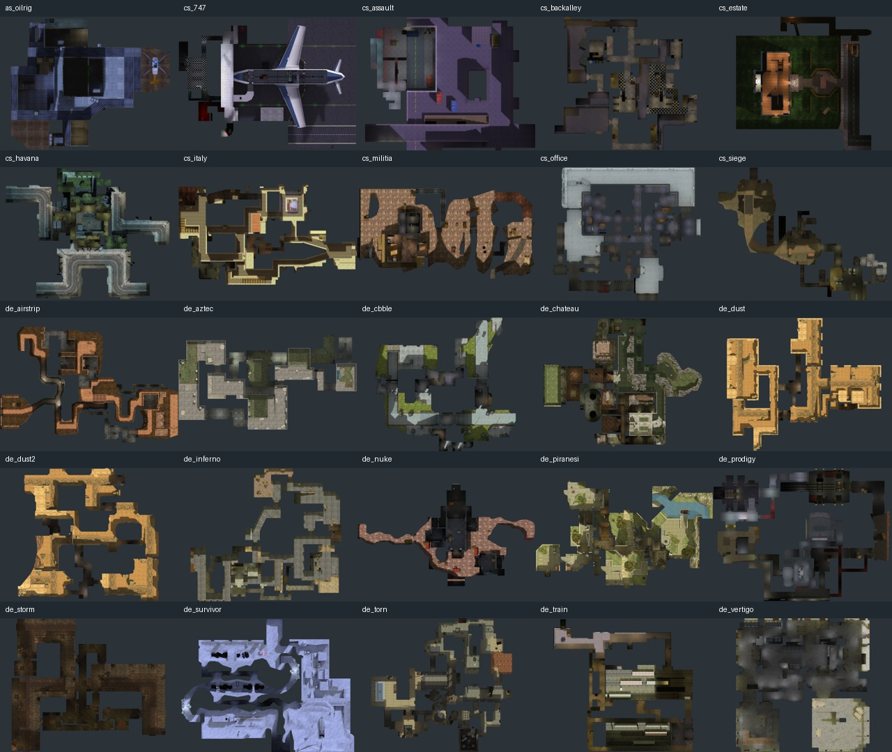
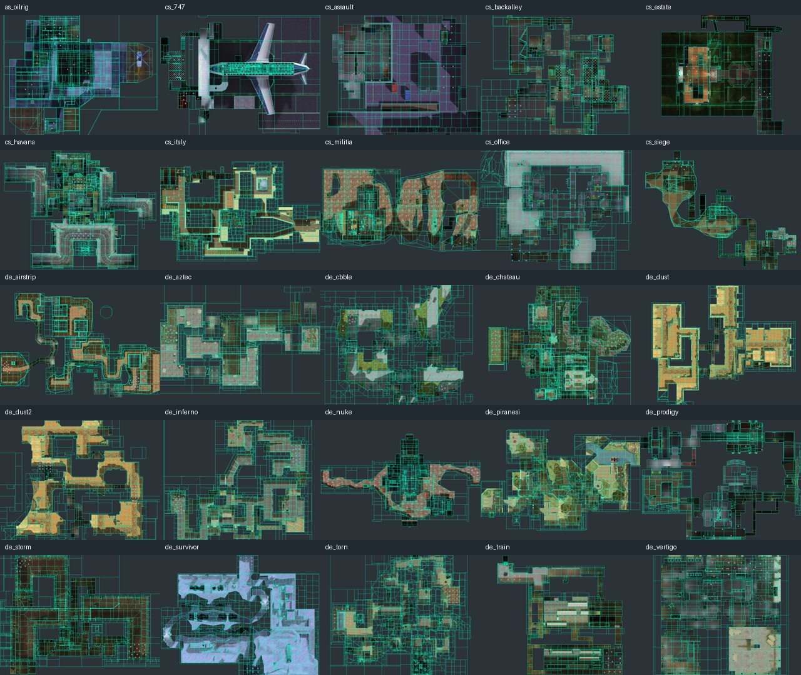
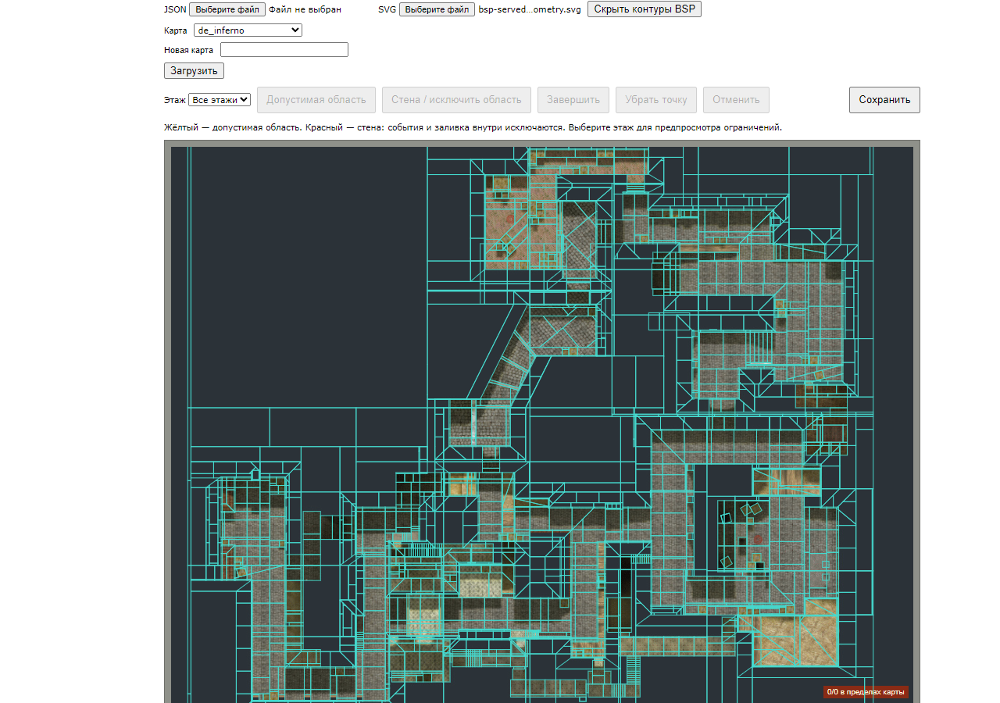

# Карты из установленной Counter-Strike — 8 сентября 2026

Дополнение: все 25 SVG и манифест соответствующих изображений включены в
`web/hlstatsimg/heatmap-geometry/cstrike`. Редактор автоматически загружает шаблон
и предлагает кнопку «Показать геометрию BSP». Проверено в браузере последовательное
переключение всех 25 карт, показ/скрытие контуров и переход на aim_map без обзора:
появляется `nomap.png`, старые контуры удаляются, кнопка недоступна. Проверены
контрольные суммы всех 25 базовых JPEG, HTTP-доступность SVG, синтаксис JS/PHP
и отсутствие ошибок форматирования diff. Полная переустановка базы не выполнялась;
шаблоны не зависят от локальных отчётов или дополнительных записей в базе.

По запросу пользователя обновлены 25 основных изображений карт и 25 миниатюр,
включая inferno. Источник — установленная Steam Counter-Strike пользователя:
парные BSP, BMP и TXT. Настройки привязки обновлены в начальных данных проекта
и отдельной локальной базе на порту 8382. Исходная игра и сервер 8281 не изменены.
Работа остаётся локальной, без публикации.

Подготовлены все совпавшие карты: as_oilrig, cs_747, cs_assault, cs_backalley,
cs_estate, cs_havana, cs_italy, cs_militia, cs_office, cs_siege, de_airstrip,
de_aztec, de_cbble, de_chateau, de_dust, de_dust2, de_inferno, de_nuke,
de_piranesi, de_prodigy, de_storm, de_survivor, de_torn, de_train, de_vertigo.

Все изображения сохраняют исходный размер 1024×768 и координаты BMP. Зелёный
фон заменён нейтральным; обрезки и изменения геометрии изображения нет.
Из BSP извлечено 164 571 поверхностей. Проверка рабочим преобразованием продукта
на 107 349 координатах дала максимальную ошибку округления 1,514 пикселя.
Это проверка привязки к установленной игре, а не подтверждение версии BSP,
на которой исторический сервер записывал события.

Проверены настройки и контрольные суммы всех 25 изображений после пересоздания
локального веб-контейнера, затем фактические ответы HTTP для всех карт.
В проверенном периоде 1736115900–1767651900 есть события на dust2 (175)
и train (46); остальные 23 карты корректно показывают отсутствие событий.
Девять целевых тестов инструмента привязки прошли. Вход пользователя в админку
и импорт геометрии inferno проверены в браузере.

Контуры включают крыши и перекрытия. Этажи и маски стен автоматически не создавались.
Старые сгенерированные статические теплокарты не пересчитывались; обновлены
именно основные изображения и миниатюры. Варианты `_2x2` без совпавшего BSP
не подменялись стандартными картами.

Пропущены 13 BSP без парного обзора: aim_ulbc_arena, aim_ulbc_picolo, aim_unima,
ctf_face, de_bombmeat, de_dinaunion, df_meat, dm_meat2, dm_meat2_test,
proj1, proj2, testet, trick_zadrot.

Полный [манифест](manifest.json) содержит настройки и контрольные суммы.
Локальные подготовленные JPEG/SVG/JSON лежат в
`scripts/replay_baseline/artifacts/heatmap-steam-20260908/pack/`, резервная копия
изображений и настроек — в соседней `backup/`. Изображения локального сайта
сохраняются в томе `heatmap-review-20260907-map-assets` при пересоздании веб-контейнера.
Запрошенная пользователем учётная запись сохранена, пароль в документацию не включён.

Повторная подготовка и импорт описаны в
[инструкции](../../../heatmap-bsp-registration.md#все-карты-из-установленной-counter-strike).
