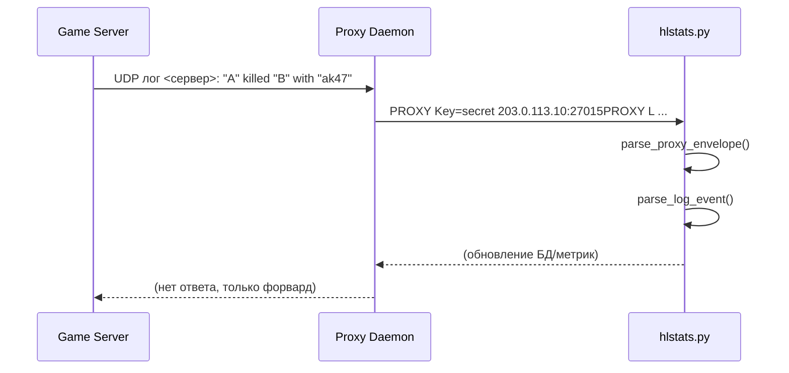

# Протокол взаимодействия `hlstats.py`

Документ фиксирует результат анализа формата UDP-пакетов, которые получают
`hlstats.pl` и Python-порт, а также описывает структуру событий игрового лога.
Материал базируется на поведении Perl-версии (`hlstats.pl`) и коде
`proxy-daemon.pl`.

## Обёртка proxy-демона

Каждый пакет от прокси содержит обёртку вида:

```
PROXY Key=<ключ> [<ip:порт>]PROXY <полезная_нагрузка>
```

* `<ключ>` — значение `Proxy_Key` из БД, совпадает с настройкой фронтенда.
* `<ip:порт>` — адрес игрового сервера. Может отсутствовать, если команда
  предназначена самому демону (`C;HEARTBEAT;` и т.п.).
* `<полезная_нагрузка>` — либо команда управления (`C;...;`), либо строка
  игрового лога, начинающаяся с префикса `L `.

Python-модуль `hlstats_py.protocol` предоставляет функцию
`parse_proxy_envelope`, которая снимает обёртку и возвращает ключ, адрес и
тело сообщения.

## Команды управления

Фронтенд взаимодействует с прокси и `hlstats.pl` через специальный формат
`C;COMMAND;`. Поддерживаются команды:

| Команда     | Действие                                     |
|-------------|-----------------------------------------------|
| HEARTBEAT   | Проверка доступности демона. Ответ: `Heartbeat OK`. |
| SERVERLIST  | Запрос списка известных игровых серверов. |
| RELOAD      | Обновление конфигурации и перечня демонов. |
| KILL        | Завершение работы сервиса. |

Функция `parse_control_command` возвращает тип команды (`ControlCommandType`)
или `None`, если полезная нагрузка не является командой.

## Формат строк лога

Игровые сервера Source-движка передают строки вида:

```
L MM/DD/YYYY - hh:mm:ss: <описание события>
```

Основной вид описания — цитированная информация об участниках и действие.
Примеры (сокращены до ключевых частей):

| Пример строки | Категория | Результат парсинга |
|---------------|-----------|--------------------|
| `"A" killed "B" with "ak47" (headshot)` | Убийство | `LogEventType.KILL`, актор, жертва, оружие, свойства (`headshot`). |
| `"A" say_team "Hold position"` | Чат | `LogEventType.CHAT`, флаг `team_only`. |
| `"A" triggered "planted_bomb" (site "A")` | Триггер | `LogEventType.TRIGGER`, имя действия, свойства. |
| `World triggered "Round_Start"` | Глобальное событие | `LogEventType.WORLD_TRIGGER`, действие. |
| `"A" connected, address "1.2.3.4:27015"` | Подключение | `LogEventType.CONNECT`, свойства (`address`). |
| `"A" joined team "CT"` | Смена команды | `LogEventType.TEAM_CHANGE`, название команды. |

Игрок описывается строкой `"Имя<userid><uniqueid><team>..."`, где:

* `userid` — временный идентификатор на сервере (число).
* `uniqueid` — SteamID или GUID.
* `team` — текущая команда (`TERRORIST`, `CT`, `Red`, `Blue`, `Unassigned` и т.д.).
* Дополнительные теги (позиция, класс) сохраняются в `additional_tokens`.

Парсер поддерживает повторяющиеся свойства (например, `player_position`) и
возвращает для них кортеж значений.

## Последовательность обмена

Ниже показаны основные взаимодействия между сервером, прокси-демоном и
модулем `hlstats.py`:



Команды управления используют тот же канал, но без адреса сервера:

```mermaid
sequenceDiagram
    participant UI as Web UI
    participant PD as Proxy Daemon
    participant HL as hlstats.py

    UI->>PD: PROXY Key=secret PROXY C;RELOAD;
    PD->>HL: C;RELOAD;
    HL->>HL: parse_control_command()
    HL-->>PD: OK, EXECUTING COMMAND: RELOAD
```

## Использование парсера

Модуль `hlstats_py.protocol` экспортирует:

* `parse_proxy_envelope(datagram)` — обёртка прокси.
* `parse_control_command(payload)` — команды `C;...;`.
* `parse_log_event(payload)` — игровые события, возвращает `LogEvent`.
* `PlayerDescriptor` и перечисления `ControlCommandType`, `LogEventType`.

Результатами анализа будут пользоваться последующие задачи миграции, где
нужно перенести обработчики событий, связывающие лог с обновлением таблиц
MySQL.
